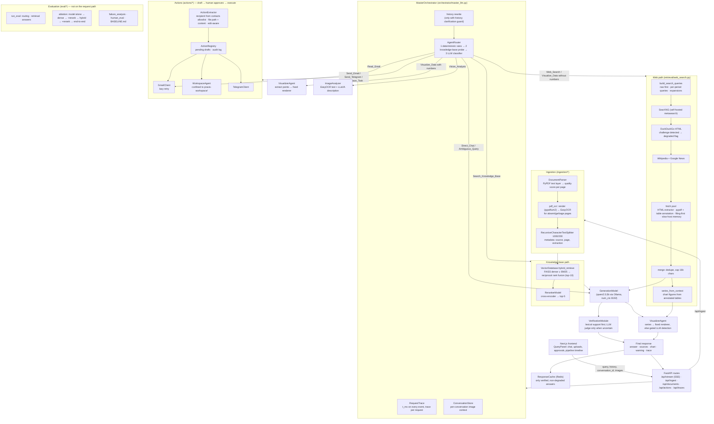

# Architecture

Drawn from the code as it is, not from the plan. Every box is a module in `backend/`;
arrows are calls. Solid boxes run on this machine; nothing leaves it unless the router
chooses web search.

## Where the time goes (one traced knowledge-base request, no cache)

| stage | seconds |
|---|---|
| router (rules / probe / classifier) | 0.0 – 1.2 |
| hybrid retrieval | 0.3 |
| cross-encoder rerank | 0.8 – 1.2 |
| generation (~150 words, 3B model) | 6 – 9 |
| verification (lexical first; LLM only when uncertain) | 0 – 3 |
| **total** | **~8 – 12**; cache hit 0.004 |

## Design rules the code follows

1. **A small model never transcribes numbers.** Chart figures come from parsed tables; the
   model only writes prose. (Measured: it hands full-year totals to quarters otherwise.)
2. **Deterministic before probabilistic.** Routing rules, the knowledge-base probe, file-target
   resolution and period-query phrasing are code; the classifier is the fallback.
3. **Every outbound action is a draft** until a human approves it, and every attempt is audited.
4. **Degraded is labelled, not hidden.** A rate-limited search says so in the timeline and is
   never cached.
5. **Every claim has a number** in `backend/eval/BASELINE.md`, reproducible with `eval/run_all.sh`.
